# Task Explorer - Tasks and Scripts Visual Control

|  | M.I.A.... A Short Story and an apology... From this extension's inception many years ago, to the time my beloved daughter and I were working on it together in 2022 and 2023 with her high hopes of it turning into a licensable product (i.e. *$$$* in her eyes), to the time life changed 4ever when I lost her in April of '23 and became undoubtedly 4everbroken, to now the present day... after the overwhelming pain of each and every day had started to seem normalized, what we had last worked on together I was finally able to pick back up and continue, and now the initial preview versions have started to be released. I sincerely apologize to all users for the absence of any development over the last few years.s |  |
| ---------- | ------------------------------- | -------------------------------------------------------- |

      

  

                   

## Description

Provides configurable treeviews that display all supported tasks and scripts, organized by project folder and groupings.  Tasks can be opened for view/edit, executed, stopped, restarted, etc.

## Table of Contents

- [Task Explorer - Tasks and Scripts Visual Control](#task-explorer---tasks-and-scripts-visual-control)
  - [Description](#description)
  - [Table of Contents](#table-of-contents)
  - [Screenshots by Version](#screenshots-by-version)
  - [Requirements](#requirements)
  - [Version 3](#version-3)
  - [Licensing](#licensing)
  - [Configuring Global Excludes, Apache Ant and Bash Globs](#configuring-global-excludes-apache-ant-and-bash-globs)
  - [Ant and Gulp Self-Provided Tasks](#ant-and-gulp-self-provided-tasks)
  - [Using Groups with a Separator](#using-groups-with-a-separator)
  - [Internally Provided Tasks vs. VSCode Provided Tasks](#internally-provided-tasks-vs-vscode-provided-tasks)
  - [Running Shell Scripts](#running-shell-scripts)
  - [Task Icon Animations](#task-icon-animations)
  - [Task Monitor](#task-monitor)
  - [Task Reports and Details](#task-reports-and-details)
  - [Roadmap Version 3.x](#roadmap-version-3x)
  - [Roadmap Version 4 (Preliminary)](#roadmap-version-4-preliminary)
  - [App-Publisher and Webpack-Wrap](#app-publisher-and-webpack-wrap)
  - [Feedback \& Issues](#feedback--issues)
  - [Rate It - Leave Some Stars](#rate-it---leave-some-stars)
  - [Thank You](#thank-you)
  - [Pre-V3 Release Features History](#pre-v3-release-features-history)

## Screenshots by Version

| Latest Explorer Tray                    | Sidebar View (v1.7)                       | Task Type Groups (v1.13)                  |
| ----------------------------------------- | ----------------------------------------- | ----------------------------------------- |
| 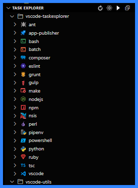 | 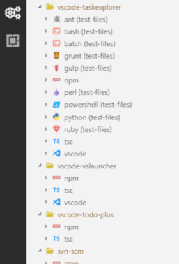 | 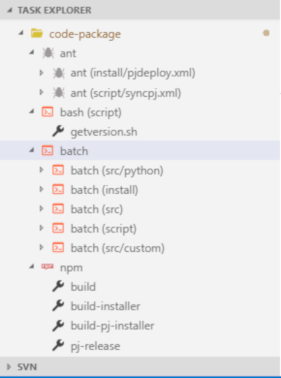 |

| Grunt/Gulp in Subfolders (v1.14)          | Npm Commands (v1.16)                      | Task Groupings (v1.23)                    |
| ----------------------------------------- | ----------------------------------------- | ----------------------------------------- |
| 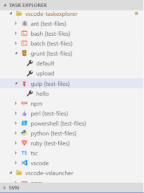 | 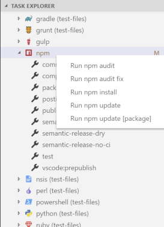 | 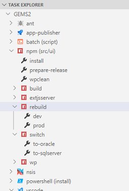 |

| Multi-Level Task Groupings (v1.29)        | Run with Args, No Terminal (1.30)         | Last Tasks (1.25) Favorites (2.0)         |
| ----------------------------------------- | ----------------------------------------- | ----------------------------------------- |
| 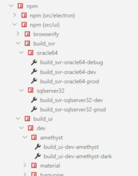 | 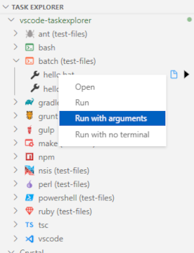 | 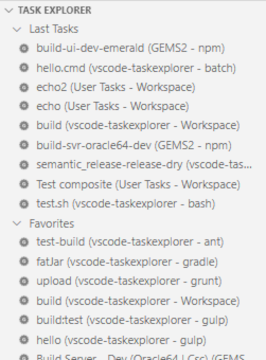 |

## Requirements

- NodeJS 22.15+
- Visual Studio Code v1.102+

"Should" work with NodeJS 18 and VSCode 1.68+, recommended version of VSCode is 1.102.x or above and NodeJS 22.15+.

## Version 3

- Significant performance enhancements
- Several fixes including longtime pre-v2 bugs
- **TaskMonitor** View | fullscreen task controls
- ESLint static type task provider
- NodeJS script type task provider
- NPM task provider to replace the limited VSCode provider
- Improvements running NPM tasks for both internal and VSCode provider
- Typescript task provider to replace the limited VSCode provider
- Laravel task provider (via collabarator)
- Optional encrypted data persistence
- Taskfile caching (optional) | lower startup times
- Restoration of tasktree 'collapsed' or 'expanded' node states
- Stats and Runtime Tracking
- Stats and Runtime Quick Reports
- Re-organized Settings with groups
- Enhanced Sidebar View container
- Improved grouping of multiple taskfiles in same project
- Support for up to 15 tree grouping levels
- Release Notes View
- Improved logging for better support and faster resolution of issues

## Licensing

Note that this release and all upcoming **preview** releases are fully functionality and for all intents and purposes is what will eventually be the "licensed version" of this extension once the licensing scheme goes into effect. Afterwards, a 30-day trial can be activated, and if necessary an additional 30-day trial can be activated by making a formal request through the website's [contact page](https://www.spmhome.io/contact).  Also no worries if a license may not be an option, because the free-for-use functionality is probably comparable to what any current users had already been used to from v2.

When the extension's **Preview** phase is over and the licensing scheme becomes active, please consider [purchasing a cheap++ license](https://www.spmhome.io/payment/taskexplorer/vsc) to unlock all features and support both continued development and my beloved never-forgotten daughter's grand plan.  During the **Preview** phase licensing is not active and the extension is fully functional.

## Configuring Global Excludes, Apache Ant and Bash Globs

The setting *exclude* defines a file/directory pattern or an array of file/directory patterns to ignore using *Glob Patterns* or a valid *File URI*.  The setting applies to all script types.  For example:

- `taskexplorer.exclude: [ "**/.vscode-test/**", "**/vendor/**", "**/out/**", "**/output/**", "/c:/projects/project1/src/theme/test/package.json" ]`

Note that the glob pattern "\*\*/node_modules/\*\*" is applied by default to the excludes list in all cases.  Using the *exclude* configuration can greatly improve performance in large workspaces if configured correctly.

Task files that are found by Task Explorer can also be added to the *excludes* list via the tree node context menu, by right clicking the task file or task group node, and selecting *Add to Excludes*.

**Apache Ant** uses an .xml file extension, the setting *globPatternsAnt* can be used to specify other file names other than [Bb]uild.xml to include as ant files so that all xml files do not need to be searched (slowing down tree refreshes in large workspaces or project with a large number of various xml files).  The setting defines a file pattern or an array of file patterns to include using *Glob Patterns* or a valid *File URI*, for example:

- `taskexplorer.globPatternsAnt: [ "**/extraTasks.xml", "**/scripts/ant/*.xml", "/c:/projects/project1/scripts/test/antetests.xml" ]`

Note that the glob pattern "\*\*/[Bb]uild.xml" is applied by default to the **Ant** includes list in all cases.  If you don't include the asterisked glob pattern `**/` first in the string, files in sub-folders will not be found.

In the same way as for **Ant** tasks, **Bash** scripts without extensions can be configured to be found by the Bash Task Provider by using glob patterns in the same way, with the *globPatternsBash* setting:

- `taskexplorer.globPatternsBash: [ "**/bash_scripts/**", "**/sh/scripts/**", "/usr/local/bin/start_task" ]`

## Ant and Gulp Self-Provided Tasks

By default, a custom parser is used to locate Ant and Gulp tasks in respective files.  This may be fine in most cases, but in cases where the script and/or build files become complex, or there is something in the file that was not coded into the parser, you can use the *ant* and *gulp* programs themselves to find their own tasks.  Note however that turning this on has a negative performance impact when refreshing and providing tasks to the VSCode Task Host.

## Using Groups with a Separator

The *Groups With Separator* option is an extra level of task groupings that can be made based on a configured separation character in the script or task name.  This option can be turned on/off with the *Group With Seperator* `'Settings -> Extensions -> Task Explorer -> Grouping'` options in the VSC Settings, the default is *on* and the default separator is a dash/hyphen ("-").

For example, consider 10 npm tasks, 5 of which all start with the string *dev-*, 5 of which start with the string *prod-*.  Prior to Version 1.23, this would create 10 individual task nodes within the main npm task node in the task tree:

    npm
        dev-build
        dev-build-server
        dev-build-themes
        dev-cp-from-binVV
        dev-clean
        prod-build
        prod-build-server
        prod-build-themes
        prod-cp-from-bin
        prod-clean

By enabling the *Group With Separator* option in Settings and setting the *Group Separator* to a dash ("-") two new grouped nodes would be created underneath the main npm node, one called *dev* and the other called *prod*.  Each of these two sub-nodes of course would contain the respective *dev-* and *prod-* scripts/tasks, minus the prepended group name:

    npm
        dev
            build
            build-server
            build-themes
            cp-from-bin
            clean
        prod
            build
            build-server
            build-themes
            cp-from-bin
            clean

## Internally Provided Tasks vs. VSCode Provided Tasks

Workspace (.vscode/tasks.json) tasks are provided by VSCode.  All other task types are or can be internally provided by TE.  It is recommended to use the TE NPM provider as opposed to the provider that ships with the VSC IDE, and for a significant increase in performance, ensure that the `'Settings -> Extensions -> Npm -> Auto Detect'` options is turned **off**** in VSCode Settings.  By default this is turned on, so if NPM tasks are randomly not displaying or NPM task startup is lagging, please check this setting.  It is also recommended that the Grunt and Gulp providers that ship with the VSC IDE are turned **off** as well, `'Settings -> Extensions -> Grunt -> Auto Detect'` and `'Settings -> Extensions -> Gulp -> Auto Detect'`.

Detection of all internally provided task types can be turned on/off in Settings - `'Settings -> Extensions -> Task Explorer -> Task Providers'`.

## Running Shell Scripts

Shell scripts, e.g. Bash/sh, batch, powershell, will have the shell executable automatically set to the corresponding shell when the script is ran.  The shell executable used can be set explicitly in the VSC Settings, i.e. `'Settings -> Extensions -> Task Explorer -> Providers -> Paths to Programs'`.

## Task Icon Animations

FOr whatever reason, on some systems the animated running task icon eats a lot of CPU.  If this is your case, the animated icon can be turned off in settings (on by default).

## Task Monitor

The Task Monitor is a webview style task console, i.e. a glorified console for developers going blind, offering some different options and a different look and feel as opposed to the original task treeviews.

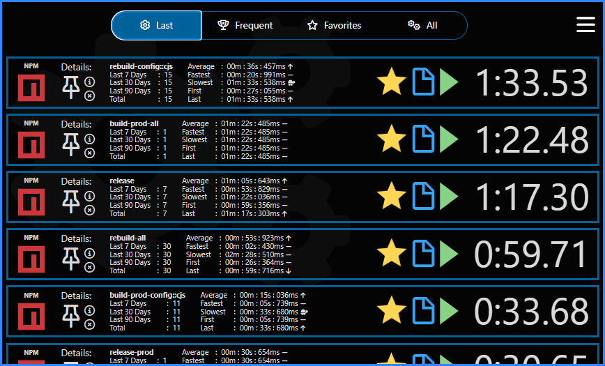 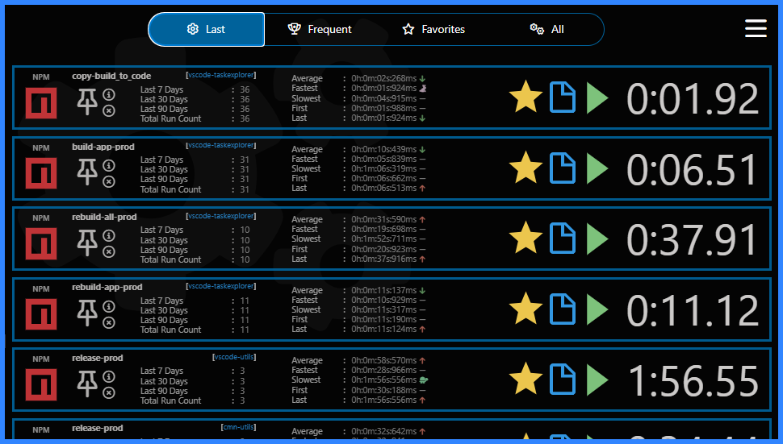

## Task Reports and Details

For debugging or curiosity, sme initial reports or details pages can be generated listing all parsed tasks, usage over time, etc.  You can generate reports and/or details pages via various context menus or navigation header icon buttons.

 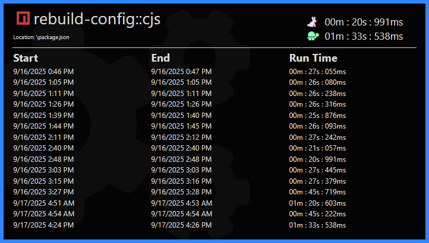

## Roadmap Version 3.x

- **TaskBuddy** View
- Configure additional/external task providers not implemented internally
- **TaskMonitor** View sorting and filtering
- TaskMonitor View 'All' Tab task control collapsible groupings by project
- Drag and Drop **TaskMonitor** View Integration with TaskBuddy View and/or Reporting
- Telemetry | Usage Reporting
- NodeJS .bin type task provider
- Run count competitions for taskfabulous prizes
- Support for jsconfig.json files in Typescript provider
- Additional Typescript static tasks, e.g. js/ts syntax checks, esm/cjs tests, etc
- Configurable Glob Patterns to customize provider file matching
- Support for level-1 task grouping by project in Favorites folder
- Create inline or parallel ran "composite tasks" via treenode multi-selection
- Github static type task provider
- Gitlab static type provider
- Jenkins static type task provider
- Additional performance enhancements
- Webpack-Wrap task provider and integration | localized ci-like implementation
- App-Publisher task provider and integration | localized ci-like implementation
- Auto-detect project svg logos to display in Favorites folder groups
- Web Portal providing account login and license assets / info
- Integrated Web Portal pages providing settings configuration from a rich UI
- React based Settings View providing settings configuration from a rich in-Vscode UI
- Visual Studio Extension **preview** release

## Roadmap Version 4 (Preliminary)

- ASR support - configurable voice recognition
- TTS support - configurable audible notifications
- Smart Home support
- Support multiple configurable instances of **TaskBuddy** View
- ** Github Issues integration
- ** Gitlab Issues integration
- ** MantisBT Issues integration
- Integrated Web Portal pages providing task automation from a rich UI
- VSCode Web browser build

## App-Publisher and Webpack-Wrap

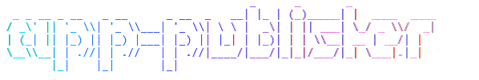 

Integrates with the [app-publisher](https://gitlab.spmhome.io/spmhome/ci/app-publisher) and [webpack-wrap](https://gitlab.spmhome.io/spmhome/ci/webpack-wrap) utility packages that emulate a small scale ci environment run locally from a project workspace, i.e. *CI without the headache* for individual devs and small teams.

## Feedback & Issues

Report any feedback, bugs, suggestions or requests via [Github Issues](https://github.com/spmeesseman/vscode-taskexplorer/issues)

You can make direct inquiries as well using the website's [contact page](https://www.spmhome.io/contact)

Feel free to check out the [Version Control System](https://gitlab.spmhme.io) for open source utilities and libraries used in all *@spmhome* projects, of course available for public use with an account and licensed under the MIT license and other well known open source license, with the latter project dependent according to any 3rd party package dependencies used by that particular package/project.

## Rate It - Leave Some Stars

Please rate your experience with stars... [like five of them ;)](https://marketplace.visualstudio.com/items?itemName=spmeesseman.vscode-taskexplorer&ssr=false#review-details)

## Thank You

Icon Contributors:

- pkief - [Material Icon Theme](https://github.com/PKief/vscode-material-icon-theme)
- idleberg - [NSIS Extension](https://marketplace.visualstudio.com/items?itemName=idleberg.nsis)
- Microsoft - [VSCode](https://github.com/Microsoft/vscode)
- Microsoft - [Maven for VSCode](https://github.com/Microsoft/vscode-maven)

Other Contributors:

- antfu
- eamodio (fixed [#114](https://github.com/spmeesseman/vscode-taskexplorer/issues/114))
- MichaelCurrin
- tiansin
- JacobParis
- Spitfire1900

## Pre-V3 Release Features History

- v2.7 - External provider integration API [#22](https://github.com/spmeesseman/vscode-taskexplorer/issues/22)
- v2.6 - Composer support [#150](https://github.com/spmeesseman/vscode-taskexplorer/issues/153) Include shellscripts with no extension [#153](https://github.com/spmeesseman/vscode-taskexplorer/issues/153) Rename tasks [#164](https://github.com/spmeesseman/vscode-taskexplorer/issues/164)
- v2.5 - Webpack build - Runs 10-15% faster.
- v2.4 - Add Pipenv support for Python Pipfile scripts. (thanks **rob4226**) [#155](https://github.com/spmeesseman/vscode-taskexplorer/issues/155)
- v2.3 - App-Publisher v2.0 support.  Several fixes including long time issue [#143](https://github.com/spmeesseman/vscode-taskexplorer/issues/143).
- v2.2 - Support for Maven (closes [#107](https://github.com/spmeesseman/vscode-taskexplorer/issues/107))
- v2.1 - App Publisher changelog pull tasks
- v2.0  - All async-await processing, Favorites (closes [#101](https://github.com/spmeesseman/vscode-taskexplorer/issues/97)), Clear special task lists
- v1.30 - Configurable default click action (closes [#97](https://github.com/spmeesseman/vscode-taskexplorer/issues/97)), Add 'Run with Arguments' command (closes [#88](https://github.com/spmeesseman/vscode-taskexplorer/issues/88)), Add 'Run with NoTerminal' command (closes [#39](https://github.com/spmeesseman/vscode-taskexplorer/issues/39)) (note that as of VSCode 1.53, there seems to be a bug that prevents running tasks without showing the terminal).
- v1.29 - Support multi-level task groupings (closes [#129](https://github.com/spmeesseman/vscode-taskexplorer/issues/129)), Support user tasks (closes [#127](https://github.com/spmeesseman/vscode-taskexplorer/issues/127))
- v1.28 - Support Makefile aliases (thanks **MichaelCurrin**)
- v1.27 - Use gulp and ant to find their respective tasks (configurable on/off) (closes [#105](https://github.com/spmeesseman/vscode-taskexplorer/issues/105)), Make grouping separator configurable (thanks **richarddavenport**)
- v1.26 - Add 'Running Task' status bar message (refs [#47](https://github.com/spmeesseman/vscode-taskexplorer/issues/47))
- v1.25 - Add 'Last Tasks' pseudo-folder
- v1.24 - Add 'Open Terminal' button to running tasks (closes [#23](https://github.com/spmeesseman/vscode-taskexplorer/issues/23))
- v1.23 - Task groupings with dashed task groups (Off by default)
- v1.22 - Major performance enhancements - Task Tree / Task Scanning
- v1.21 - Add option to keep terminal open after stopping task (closes [#51](https://github.com/spmeesseman/vscode-taskexplorer/issues/51))
- v1.20 - Add support for restarting task (thanks **antfu**)
- v1.19 - App-Publisher task support for BETA testing
- v1.18 - Add 'Add to excludes' action in task file node context menu
- v1.17 - Add 'Run last task' button to titlebar
- v1.16 - Add npm management tasks to npm file node context menus
- v1.15 - Support for gradle tasks (includes provider) (closes [#15](https://github.com/spmeesseman/vscode-taskexplorer/issues/15))
- v1.14 - Support for grunt and gulp task files not located in the project root (closes [#12](https://github.com/spmeesseman/vscode-taskexplorer/issues/15))
- v1.13 - Multiple task files of the same type placed within a group node for less clutter in folder level nodes
- v1.12 - Support for bash, batch, perl, powershell, python, ruby, and nsis scripts (includes provider)
- v1.11 - N/A - Obsolete Batch Task Provider replaced by v1.12 ScriptProvider
- v1.10 - Support for Makefiles (includes provider)
- v1.9 - Support for gulp and grunt tasks (includes provider)
- v1.8 - Support for ant files not named [Bb]uild.xml, ansicon output colorization fixed
- v1.7 - Two view types - Use one or both of either SideBar View and/or Explorer Tray
- v1.6 - Progress icons for running tasks
- v1.6 - Stop execution button for running tasks
- v1.5 - Support for Apache Ant tasks (includes provider)
- v1.4 - Support for TSC tasks
- v1.3 - Support for Visual Studio Code tasks
- v1.2 - Convenient layout - groups all tasks by project folder, by task file, by task
- v1.1 - Supports multi-root or single-root workspaces
- v1.0 - Open and launch NPM scripts as tasks
