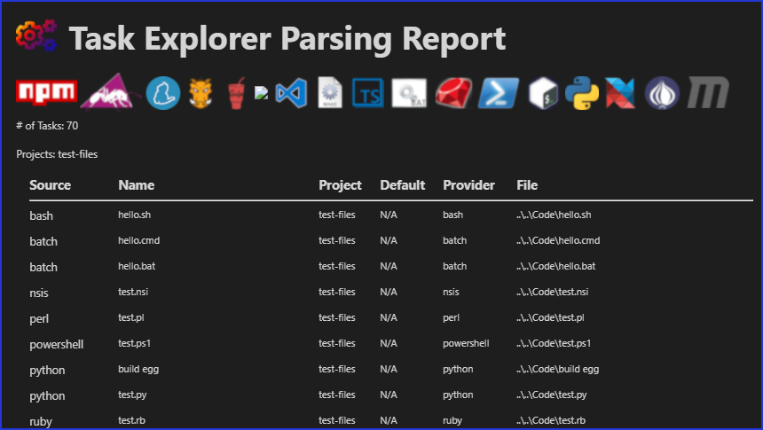

# Task Explorer - View and Run Tasks from Visual Studio Code

**The most downloaded task related extension on the Marketplace**

               

_**IMPORTANT NOTE**_: This extension has surpassed where I was ever going to take it, and the time that ended up going into it were more than I ever intended.  Considering a pay scheme (cheap, e.g. $10 - $20), with free usage up to the # of to-be-determined number of parsed tasks.  Note the license, this codebase is NOT permitted to be copied or distributed without my permission.

## Description

Provides a view in either (or both) the SideBar and/or Explorer that displays all supported tasks organized into a treeview, with parent task file nodes, grouped nodes, and project folders (convenient for large multi-root workspaces).  Tasks can be opened for view/edit, executed, and stopped, among other things for specific task types, for example NPM file nodes support common npm command(s) (i.e. 'install') via context menu.

## Table of Contents

- [Task Explorer - View and Run Tasks from Visual Studio Code](#task-explorer---view-and-run-tasks-from-visual-studio-code)
  - [Description](#description)
  - [Table of Contents](#table-of-contents)
  - [Screenshots by Version](#screenshots-by-version)
  - [Requirements](#requirements)
  - [Features by Version](#features-by-version)
  - [Version 2](#version-2)
  - [App-Publisher](#app-publisher)
  - [Configuring Global Excludes, Apache Ant and Bash Globs](#configuring-global-excludes-apache-ant-and-bash-globs)
  - [Ant and Gulp Self-Provided Tasks](#ant-and-gulp-self-provided-tasks)
  - [Using Groups with a Separator](#using-groups-with-a-separator)
  - [Internally Provided Tasks vs. VSCode Provided Tasks](#internally-provided-tasks-vs-vscode-provided-tasks)
  - [Running bash/sh scripts in Windows Environment](#running-bashsh-scripts-in-windows-environment)
  - [Running Task Icon Animations](#running-task-icon-animations)
  - [Webpack 5 Problem Matcher](#webpack-5-problem-matcher)
  - [Parsing Reports](#parsing-reports)
  - [External Provider Integration API](#external-provider-integration-api)
  - [Feedback \& Contributing](#feedback--contributing)
    - [Rate It - Leave Some Stars](#rate-it---leave-some-stars)
  - [Thank You](#thank-you)
  - [Open Source Projects](#open-source-projects)
  - [Donations](#donations)

## Screenshots by Version

| Original Explorer Tray                    | Sidebar View (v1.7)                       | Task Type Groups (v1.13)                  |
| ----------------------------------------- | ----------------------------------------- | ----------------------------------------- |
|  |  |  |

| Grunt/Gulp in Subfolders (v1.14)          | Npm Commands (v1.16)                      | Task Groupings (v1.23)                    |
| ----------------------------------------- | ----------------------------------------- | ----------------------------------------- |
|  |  |  |

| Multi-Level Task Groupings (v1.29)        | Run with Args, No Terminal (1.30)         | Last Tasks (1.25) Favorites (2.0)         |
| ----------------------------------------- | ----------------------------------------- | ----------------------------------------- |
|  |  |  |

## Requirements

- Visual Studio Code v1.50+

"Should" work with VSCode versions 1.30 and above, but am no longer running tests against VSCode versions below 1.50 as of 2/5/2021 (v1.28.0).

## Features by Version

- v2.7 - External provider integration API [#22](https://github.com/spmeesseman/vscode-taskexplorer/issues/22)
- v2.6 - Composer support [#150](https://github.com/spmeesseman/vscode-taskexplorer/issues/153) Include shellscripts with no extension [#153](https://github.com/spmeesseman/vscode-taskexplorer/issues/153) Rename tasks [#164](https://github.com/spmeesseman/vscode-taskexplorer/issues/164)
- v2.5 - Webpack build - Runs 10-15% faster.
- v2.4 - Add Pipenv support for Python Pipfile scripts. (thanks **rob4226**) [#155](https://github.com/spmeesseman/vscode-taskexplorer/issues/155)
- v2.3 - App-Publisher v2.0 support.  Several fixes including long time issue [#143](https://github.com/spmeesseman/vscode-taskexplorer/issues/143).
- v2.2 - Support for Maven (closes [#107](https://github.com/spmeesseman/vscode-taskexplorer/issues/107))
- v2.1 - App Publisher changelog pull tasks
- v2.0  - All async-await processing, Favorites (closes [#101](https://github.com/spmeesseman/vscode-taskexplorer/issues/97)), Clear special task lists
- v1.30 - Configurable default click action (closes [#97](https://github.com/spmeesseman/vscode-taskexplorer/issues/97)), Add 'Run with Arguments' command (closes [#88](https://github.com/spmeesseman/vscode-taskexplorer/issues/88)), Add 'Run with NoTerminal' command (closes [#39](https://github.com/spmeesseman/vscode-taskexplorer/issues/39)) (note that as of VSCode 1.53, there seems to be a bug that prevents running tasks without showing the terminal).
- v1.29 - Support multi-level task groupings (closes [#129](https://github.com/spmeesseman/vscode-taskexplorer/issues/129)), Support user tasks (closes [#127](https://github.com/spmeesseman/vscode-taskexplorer/issues/127))
- v1.28 - Support Makefile aliases (thanks **MichaelCurrin**)
- v1.27 - Use gulp and ant to find their respective tasks (configurable on/off) (closes [#105](https://github.com/spmeesseman/vscode-taskexplorer/issues/105)), Make grouping separator configurable (thanks **richarddavenport**)
- v1.26 - Add 'Running Task' status bar message (refs [#47](https://github.com/spmeesseman/vscode-taskexplorer/issues/47))
- v1.25 - Add 'Last Tasks' pseudo-folder
- v1.24 - Add 'Open Terminal' button to running tasks (closes [#23](https://github.com/spmeesseman/vscode-taskexplorer/issues/23))
- v1.23 - Task groupings with dashed task groups (Off by default)
- v1.22 - Major performance enhancements - Task Tree / Task Scanning
- v1.21 - Add option to keep terminal open after stopping task (closes [#51](https://github.com/spmeesseman/vscode-taskexplorer/issues/51))
- v1.20 - Add support for restarting task (thanks **antfu**)
- v1.19 - App-Publisher task support for BETA testing
- v1.18 - Add 'Add to excludes' action in task file node context menu
- v1.17 - Add 'Run last task' button to titlebar
- v1.16 - Add npm management tasks to npm file node context menus
- v1.15 - Support for gradle tasks (includes provider) (closes [#15](https://github.com/spmeesseman/vscode-taskexplorer/issues/15))
- v1.14 - Support for grunt and gulp task files not located in the project root (closes [#12](https://github.com/spmeesseman/vscode-taskexplorer/issues/15))
- v1.13 - Multiple task files of the same type placed within a group node for less clutter in folder level nodes
- v1.12 - Support for bash, batch, perl, powershell, python, ruby, and nsis scripts (includes provider)
- v1.11 - N/A - Obsolete Batch Task Provider replaced by v1.12 ScriptProvider
- v1.10 - Support for Makefiles (includes provider)
- v1.9 - Support for gulp and grunt tasks (includes provider)
- v1.8 - Support for ant files not named [Bb]uild.xml, ansicon output colorization fixed
- v1.7 - Two view types - Use one or both of either SideBar View and/or Explorer Tray
- v1.6 - Progress icons for running tasks
- v1.6 - Stop execution button for running tasks
- v1.5 - Support for Apache Ant tasks (includes provider)
- v1.4 - Support for TSC tasks
- v1.3 - Support for Visual Studio Code tasks
- v1.2 - Convenient layout - groups all tasks by project folder, by task file, by task
- v1.1 - Supports multi-root or single-root workspaces
- v1.0 - Open and launch NPM scripts as tasks

## Version 2

Version 2 highlights 2 major performance enhancements along with several features and bug fixes, notably:

1. An async/await approach for all processing has improved task load time performance 10-20%.
2. Launching tasks is more than 2x more responsive in the Tree UI, as well as when tasks finish.
3. Favorites List.
4. Clear buttons for Favorites and last Tasks lists (**need icon!!!**).
5. Much improved logging for debugging user issues.
6. Completely refactored classes, interfaces, and commenting for easier community contributions.

## App-Publisher

Integrates with the [app-publisher](https://github.com/spmeesseman/app-publisher) tool.

App-Publisher is a multi-purpose versioning/release tool that can be used for, but not limited to, the following:

- Publish releases in a CI like manner on a local system, with version calculation.
- Several task-mode tasks such as generating the next version from commit message subjects.
- NPM releases.
- GitHub Releases.
- MantisBT releases via the [Releases Plugin](https://github.com/mantisbt-plugins/Releases).
- View/output changelogs for a pending release.

## Configuring Global Excludes, Apache Ant and Bash Globs

The setting *exclude* defines a file/directory pattern or an array of file/directory patterns to ignore using *Glob Patterns* or a valid *File URI*.  The setting applies to all script types.  For example:

- `taskExplorer.exclude: [ "**/.vscode-test/**", "**/vendor/**", "**/out/**", "**/output/**", "/c:/projects/project1/src/theme/test/package.json" ]`

Note that the glob pattern "\*\*/node_modules/\*\*" is applied by default to the excludes list in all cases.  Using the *exclude* configuration can greatly improve performance in large workspaces if configured correctly.

Task files that are found by Task Explorer can also be added to the *excludes* list via the tree node context menu, by right clicking the task file or task group node, and selecting *Add to Excludes*.

**Apache Ant** uses an .xml file extension, the setting *globPatternsAnt* can be used to specify other file names other than [Bb]uild.xml to include as ant files so that all xml files do not need to be searched (slowing down tree refreshes in large workspaces or project with a large number of various xml files).  The setting defines a file pattern or an array of file patterns to include using *Glob Patterns* or a valid *File URI*, for example:

- `taskExplorer.globPatternsAnt: [ "**/extraTasks.xml", "**/scripts/ant/*.xml", "/c:/projects/project1/scripts/test/antetests.xml" ]`

Note that the glob pattern "\*\*/[Bb]uild.xml" is applied by default to the **Ant** includes list in all cases.  If you don't include the asterisked glob pattern `**/` first in the string, files in sub-folders will not be found.

In the same way as for **Ant** tasks, **Bash** scripts without extensions can be configured to be found by the Bash Task Provider by using glob patterns in the same way, with the *globPatternsBash* setting:

- `taskExplorer.globPatternsBash: [ "**/bash_scripts/**", "**/sh/scripts/**", "/usr/local/bin/start_task" ]`

## Ant and Gulp Self-Provided Tasks

By default, a custom parser is used to locate Ant and Gulp tasks in respective files.  This may be fine in most cases, but in cases where the script and/or build files become complex, or there is something in the file that was not coded into the parser, you can use the *ant* and *gulp* programs themselves to find their own tasks.  Note however that turning this on has a negative performance impact when refreshing and providing tasks to the VSCode Task Host.

## Using Groups with a Separator

**EXPERIMENTAL**
The *Groups With Separator* option is simply an extra level of task groupings that can be made based on a configured separation character in the script name.  This option can be turned on/off with the *Group With Seperator* option in Settings, the default is OFF. The default separator is a dash ("-").

For example, consider 10 npm tasks, 5 of which all start with the string *dev-*, 5 of which start with the string *prod-*.  Prior to Version 1.23, this would create 10 individual task nodes within the main npm task node in the task tree:

    npm
        dev-build
        dev-build-server
        dev-build-themes
        dev-cp-from-bin
        dev-clean
        prod-build
        prod-build-server
        prod-build-themes
        prod-cp-from-bin
        prod-clean

By enabling the *Group With Separator* option in Settings and setting the *Group Separator* to a dash ("-") two new grouped nodes would be created underneath the main npm node, one called *dev* and the other called *prod*.  Each of these two sub-nodes of course would contain the respective *dev-* and *prod-* scripts/tasks, minus the prepended group name:

    npm
        dev
            build
            build-server
            build-themes
            cp-from-bin
            clean
        prod
            build
            build-server
            build-themes
            cp-from-bin
            clean

## Internally Provided Tasks vs. VSCode Provided Tasks

The following tasks are provided by VSCode:

- Workspace (.vscode/tasks.json)
- NPM (**/package.json)

All other tasks are internally provided.  Workspace tasks are detected by VSCode in all cases.  However, NPM tasks are detected only if the setting `'Npm -> Auto Detect'` is turned on in VSCode Settings.  By default this is turned on, but if NPM tasks are not displaying, please check this setting, also check the setting that turns npm package management off in favor of Yarn `'Npm -> Package manager'`.  A future release will contain internally provided NPM and Yarn tasks.  Note these tasks are still displayed in the Task Tree, just not "provided" by this extension.

Detection of all internally provided task types can be turned on/off in Settings - `'Task Explorer -> Enable [Tasktype]'`.

## Running bash/sh scripts in Windows Environment

Bash/sh scripts in Windows will have the shell executable automatically set to a bash shell (if the default shell set in VSCode is not bash).  The shell executable used can be set in Settings using the `pathToBash` setting.  If there is no value set in Settings, and Git Bash exists at the default installation installation, Git Bash will be used (MinGW).  If Git Bash does not exist at the default install location, it is assumed the the path to bash.exe is part of the system PATH variable.  If you experience errors running Bash scripts in Windows, please check these items.

## Running Task Icon Animations

For whatever reason, on some systems the animated running task icon eats a lot of CPU.  If this is your case, the animated icon can be turned off in settings (on by default).

## Webpack 5 Problem Matcher

For extension developers, this extension contributes a basic problem matcher for Webpack 5 - `$webpackte`.  To set up a watch task for debugging a Webpack 5 VSCode extension build, you can add an entry like the following to the VSCode tasks.json file:

    {
        "type": "npm",
        "script": "webpack-watch",
        "problemMatcher": "$webpackte",
        "isBackground": true,
        "presentation": {
            "reveal": "always"
        },
        "group": {
            "kind": "build",
            "isDefault": true
        }
    }

And in the package.json file:

    scripts: {
        ...,
        "webpack-watch": "webpack -w --env environment=dev --config ./webpack.config.js"
    }

## Parsing Reports

For debugging or curiosity, a report can be generated listing all parsed components and the properties found.  You can generate a report in the explorer context menus using the `Task Explorer: View Parsing Report` menu item.

## External Provider Integration API

Any extension that implements `TaskProvider` (specifically it's `provideTasks` method) can add it's tasks to the Task Explorer tree.  To register an external provider with Task Explorer, follow these steps:

Get the TaskExplorer API object:

    const teApi = await vscode.commands.executeCommand("taskExplorer.getApi");

Alternatively, using the Task Explorer type definitions:

    let teApi;
    const taskExplorer = extensions.getExtension("spmeesseman.vscode-taskexplorer");
    if (taskExplorer && taskExplorer.isActive)
    {
        teApi = taskExplorer.exports as TaskExplorerApi;
    }

**Note:** Before using any of the API functions, check busy status using the `teApi.isBusy` API function first, to ensure the indexer is not running.

Register the instance of `TaskProvider` or `ExternalExplorerProvider` using the `register` method of the Task Explorer API object:

    await teApi.register("taskTypeName", myProvider as TaskProvider);

Where *taskTypeName* is the name of the task type, i.e. "npm", "ant", "gulp", etc, and `myProvider` is the instance of TaskProvider that implements the `provideTasks` method.

Any provider(s) should be unregistered in the deactivate method of an extension, to remove a provider:

    await teApi.unregister("taskTypeName");

Where *taskTypeName* is the name of the task type, i.e. "npm", "ant", "gulp".

You can optionally install the Task Explorer API types:

    npm install @spmeesseman/vscode-taskexplorer-types

The provided tasks must implement the taskExplorer.external task interface:

    {
        script: "the task name",
        target: "command to run",
        path: "file path",
        fileName: "file name",
        uri: file `Uri`,
        taskItemId: (internal use, ignore),
        icon: {
            light: "/path/to/light.svg",
            dark: "/path/to/dark.svg"
        }
    }

The task definition must also define most of the interface properties in the package.json, for completeness, the entire definition is:

    "taskDefinitions": [
    {
        "type": "extjs",
        "required": [],
        "properties": {
            "script": {
                "type": "string",
                "description": "taskdef.task.script"
            },
            "target": {
                "type": "string",
                "description": "taskdef.task.target"
            },
            "cmdLine": {
                "type": "string",
                "description": "taskdef.task.cmdLine"
            },
            "fileName": {
                "type": "string",
                "description": "taskdef.task.fileName"
            },
            "icon": {
                "type": "string",
                "description": "taskdef.task.icon"
            },
            "iconDark": {
                "type": "string",
                "description": "taskdef.task.icon.dark"
            },
            "isDefault": {
                "type": "boolean",
                "description": "taskdef.task.isDefault"
            },
            "path": {
                "type": "string",
                "description": "taskdef.task.path"
            },
            "taskItemId": {
                "type": "string",
                "description": "taskdef.task.taskItemId"
            },
            "uri": {
                "type": "object",
                "description": "taskdef.task.fileUri"
            }
        }
    }]

The definition will be reduced in the future.  This definition is remnant of Task Explorer's early days and is in need of a cleanup.

For reference, the entire Task Explorer API object is:

    interface TaskExplorerApi
    {
        log: any;
        utilities: any;
        fileCache: any;
        explorerProvider: TaskTreeDataProvider | undefined;
        sidebarProvider: TaskTreeDataProvider | undefined;
        taskProviders: Map<string, TaskExplorerProvider>;
        registerProvider(providerName: string, provider: TaskProvider): void;
        unregisterProvider(providerName: string): void;
    }

Putting it all together:

    async function activate()
    {
        ... other code ...
        const taskProvider = new ExtJsTaskProvider();
        context.subscriptions.push(tasks.registerTaskProvider("extjs", taskProvider));
        registerWithTaskExplorer(taskProvider);
        ... other code ...
    }

    async function deactivate()
    {
        ... other code ...
        const taskExplorer = extensions.getExtension("spmeesseman.vscode-taskexplorer");
        if (taskExplorer && taskExplorer.isActive && taskExplorerRegistered)
        {
            const teApi = taskExplorer.exports as TaskExplorerApi;
            await teApi.unregister("extjs");
        }
        ... other code ...
        return Promise.resolve();
    }

    function registerWithTaskExplorer(taskProvider: ExternalExplorerProvider)
    {
        const taskExplorer = extensions.getExtension("spmeesseman.vscode-taskexplorer");
        if (taskExplorer && taskExplorer.isActive)
        {
            const teApi = taskExplorer.exports as TaskExplorerApi;
            if (!teApi.isBusy())
            {
                await teApi.register("taskTypeName", taskProvider);
                taskExplorerRegistered = true;
            }
            else {
                setTimeout(() => registerWithTaskExplorer(taskProvider), 1000);
            }
        }
        else
        {
            setTimeout(() => registerWithTaskExplorer(taskProvider), 5000);
        }
    }

- As of v2.7.0, the external task API has not been formally tested, a.  Who will be the guineau?  Hahaha ;)
- As of v2.7.0, the API does not support custom icons from the task definition, but for extension testing you can place an icon in `res/sources` or `res/dark` / `res/light` of the TaskExplorer installation folder, named using the same task type name in the `registerProvider` call mentioned above, and will be used by the Task Explorer tree.

## Feedback & Contributing

- Please report any bugs, suggestions or documentation requests via the
  [Issues](https://github.com/spmeesseman/vscode-taskexplorer/issues)
- Feel free to submit
  [Pull Requests](https://github.com/spmeesseman/vscode-taskexplorer/pulls)
- [Contributors](https://github.com/spmeesseman/vscode-taskexplorer/graphs/contributors)

### Rate It - Leave Some Stars

Please rate your experience with stars... [like five of them ;)](https://marketplace.visualstudio.com/items?itemName=spmeesseman.vscode-taskexplorer&ssr=false#review-details)

## Thank You

Icon Contributors:

- pkief - [Material Icon Theme](https://github.com/PKief/vscode-material-icon-theme)
- idleberg - [NSIS Extension](https://marketplace.visualstudio.com/items?itemName=idleberg.nsis)
- Microsoft - [VSCode](https://github.com/Microsoft/vscode)
- Microsoft - [Maven for VSCode](https://github.com/Microsoft/vscode-maven)

Other Contributors:

- antfu
- eamodio (fixed [#114](https://github.com/spmeesseman/vscode-taskexplorer/issues/114))
- MichaelCurrin
- tiansin
- JacobParis
- Spitfire1900

## Open Source Projects

|Package|Use Case|Repository|Marketplace|
|-|-|-|-|
|app-publisher|Release Automation / CI|[GitHub](https://www.npmjs.com/package/@spmeesseman/app-publisher)|[Npmjs.org Registry](https://www.npmjs.com/package/@spmeesseman/app-publisher)|
|arg-parser|Node Argument Parser|[GitHub](https://github.com/spmeesseman/arg-parser)|[Npmjs.org Registry](https://www.npmjs.com/package/@spmeesseman/arg-parser)|
|code-package|Code Dev Environment|[GitHub](https://github.com/spmeesseman/code-package)|[GitHub Releases](https://github.com/spmeesseman/code-package/releases)|
|env-ci|CI ENvironment Detection|[GitHub](https://github.com/spmeesseman/env-ci)|[Npmjs.org Registry](https://www.npmjs.com/package/@spmeesseman/env-ci)|
|extjs-pkg-filterbar|ExtJS Grid Filter Bar|[GitHub](https://github.com/spmeesseman/extjs-pkg-filterbar)|[Npmjs.org Registry](https://www.npmjs.com/package/@spmeesseman/extjs-pkg-filterbar)|
|extjs-pkg-fontawesome|ExtJS FontAwesome Integration|[GitHub](https://github.com/spmeesseman/extjs-pkg-fontawesome)|[Npmjs.org Registry](https://www.npmjs.com/package/@spmeesseman/extjs-pkg-fontawesome)|
|extjs-pkg-fontawesome-pro|ExtJS FontAwesome Pro Integration|[GitHub](https://github.com/spmeesseman/extjs-pkg-fontawesome-pro)|[Npmjs.org Private Registry](https://www.npmjs.com/package/@spmeesseman/@spmeesseman/extjs-pkg-fontawesome-pro)|
|extjs-pkg-intltelinput|ExtJS IntlTelInput Wrapper|[GitHub](https://github.com/spmeesseman/extjs-pkg-intltelinput)|[Npmjs.org Registry](https://www.npmjs.com/package/@spmeesseman/extjs-pkg-intltelinput)|
|extjs-pkg-mantis|ExtJS MantisBT Integration|[GitHub](https://github.com/spmeesseman/extjs-pkg-mantis)|[Npmjs.org Registry](https://www.npmjs.com/package/@spmeesseman/extjs-pkg-mantis)|
|extjs-pkg-plyr|ExtJS Plyr Wrapper|[GitHub](https://github.com/spmeesseman/extjs-pkg-plyr)|[Npmjs.org Registry](https://www.npmjs.com/package/@spmeesseman/extjs-pkg-plyr)|
|extjs-pkg-tinymce|ExtJS TinyMCE Wrapper|[GitHub](https://github.com/spmeesseman/extjs-pkg-tinymce)|[Npmjs.org Registry](https://www.npmjs.com/package/@spmeesseman/extjs-pkg-tinymce)|
|extjs-pkg-websocket|ExtJS WebSocket Wrapper|[GitHub](https://github.com/spmeesseman/extjs-pkg-websocket)|[Npmjs.org Registry](https://www.npmjs.com/package/@spmeesseman/extjs-pkg-websocket)|
|extjs-pkg-webworker|ExtJS WebWorker Wrapper|[GitHub](https://github.com/spmeesseman/extjs-pkg-webworker)|[Npmjs.org Registry](https://www.npmjs.com/package/@spmeesseman/extjs-pkg-webworker)|
|jenkins-mantisbt-plugin|Jenkins MantisBT Integration|[GitHub](https://github.com/spmeesseman/jenkins-mantisbt-plugin)|[Npmjs.org Registry](https://www.npmjs.com/package/@spmeesseman/jenkins-mantisbt-plugin)|
|jenkins-utility-server|Jenkins Desktop Server|[GitHub](https://github.com/spmeesseman/jenkins-utility-server)|[Npmjs.org Registry](https://www.npmjs.com/package/@spmeesseman/jenkins-utility-server)|
|mantisbt|MantisBT Custom Site|[GitHub](https://github.com/spmeesseman/mantisbt)|[GitHub Releases](https://github.com/spmeesseman/mantisbt/releases)|
|ApiExtend|MantisBT API Extensions|[GitHub](https://github.com/mantisbt-plugins/ApiExtend)|[GitHub Releases](https://github.com/mantisbt-plugins/ApiExtend/releases)|
|CommitReact|MantisBT Post Commit Actions|[GitHub](https://github.com/mantisbt-plugins/CommitReact)|[GitHub Releases](https://github.com/mantisbt-plugins/CommitReact/releases)|
|GanttChart|MantisBT Gantt Chart|[GitHub](https://github.com/mantisbt-plugins/GanttChart)|[GitHub Releases](https://github.com/mantisbt-plugins/GanttChart/releases)|
|IFramed|MantisBT IFramed Pages|[GitHub](https://github.com/mantisbt-plugins/IFramed)|[GitHub Releases](https://github.com/mantisbt-plugins/IFramed/releases)|
|ProjectPages|MantisBT Custom Nav Buttons|[GitHub](https://github.com/mantisbt-plugins/ProjectPages)|[GitHub Releases](https://github.com/mantisbt-plugins/ProjectPages/releases)|
|Releases|MantisBT Releases Management|[GitHub](https://github.com/mantisbt-plugins/Releases)|[GitHub Releases](https://github.com/mantisbt-plugins/Releases/releases)|
|SecurityExtend|MantisBT SPAM Filter|[GitHub](https://github.com/mantisbt-plugins/SecurityExtend)|[GitHub Releases](https://github.com/mantisbt-plugins/SecurityExtend/releases)|
|ServerFiles|MantisBT Server File Editor|[GitHub](https://github.com/mantisbt-plugins/ServerFiles)|[GitHub Releases](https://github.com/mantisbt-plugins/ServerFiles/releases)|
|svn-scm-ext|VSCode SVN Extension|[GitHub](https://github.com/spmeesseman/svn-scm-ext)|[Visual Studio Marketplace](https://marketplace.visualstudio.com/itemdetails?itemName=spmeesseman.svn-scm-ext)|
|vscode-extjs|VSCode ExtJS Intellisense|[GitHub](https://github.com/spmeesseman/vscode-extjs)|[Visual Studio Marketplace](https://marketplace.visualstudio.com/itemdetails?itemName=spmeesseman.vscode-extjs)|
|vscode-taskexplorer|VSCode Tasks Management|[GitHub](https://github.com/spmeesseman/vscode-taskexplorer)|[Visual Studio Marketplace](https://marketplace.visualstudio.com/itemdetails?itemName=spmeesseman.vscode-taskexplorer)|
|vscode-vslauncher|VSCode VS Project Launcher|[GitHub](https://github.com/spmeesseman/vscode-vslauncher)|[Visual Studio Marketplace](https://marketplace.visualstudio.com/itemdetails?itemName=spmeesseman.vscode-vslauncher)|

## Donations

If my work and this extension has made your life easier, consider a [donation](https://www.paypal.com/cgi-bin/webscr?cmd=_donations&business=YWZXT3KE2L4BA&item_name=taskexplorer&currency_code=USD).  All donations go straight to the *Single Dad ATM*.
